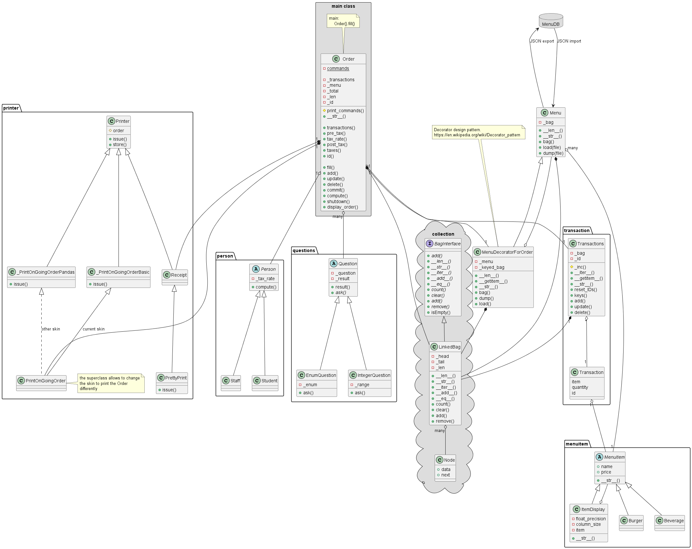

# Midterm project for CIST-005B - Advanced Python, West Valley CC
System to handle burger ordering for the on-site diner

** Basic functionalities to:**
* load the Menu burgers from a JSON file emulating the connection to a database
* selecting the burgers and their quantities
* editing an order to change the quantities or delete a transaction
* issuing the receipt
* storing the receipt on file (receipt_*.txt)

The unit tests and integration tests are provided in *_test.py files.

